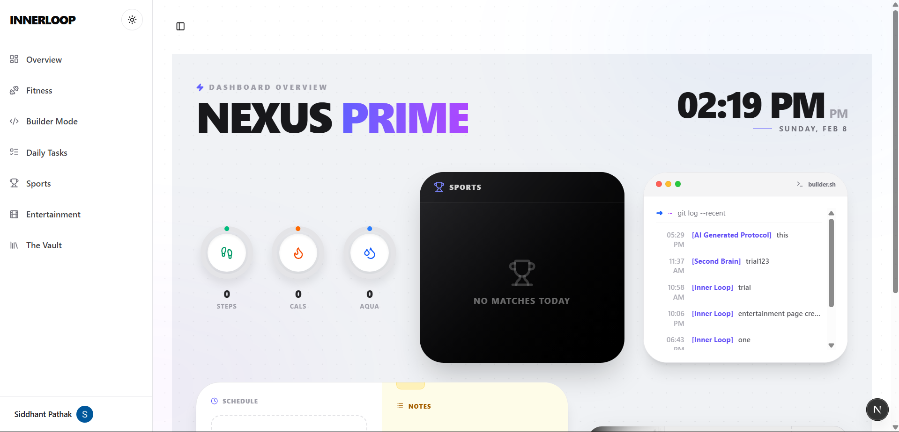
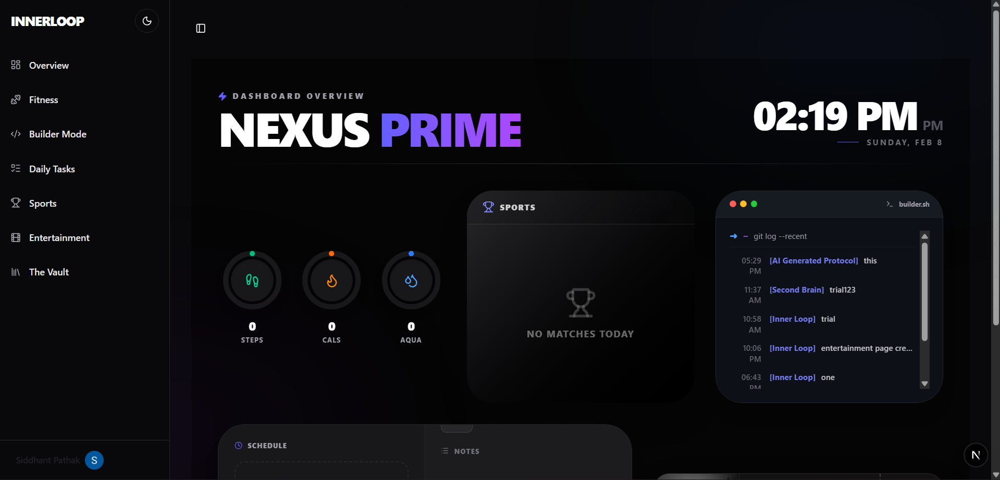
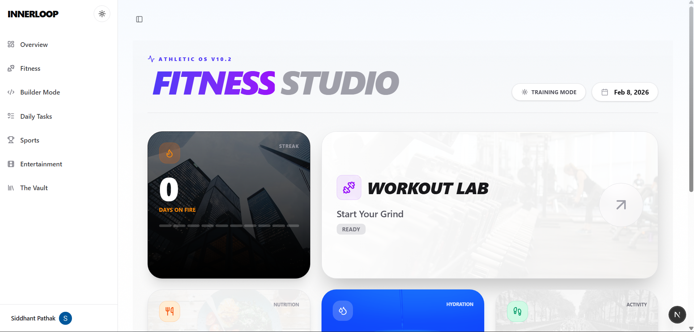
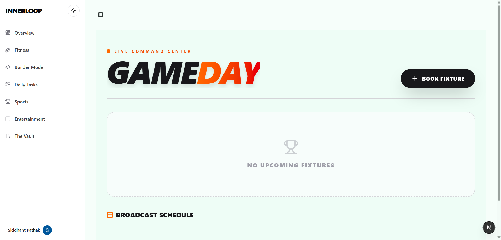
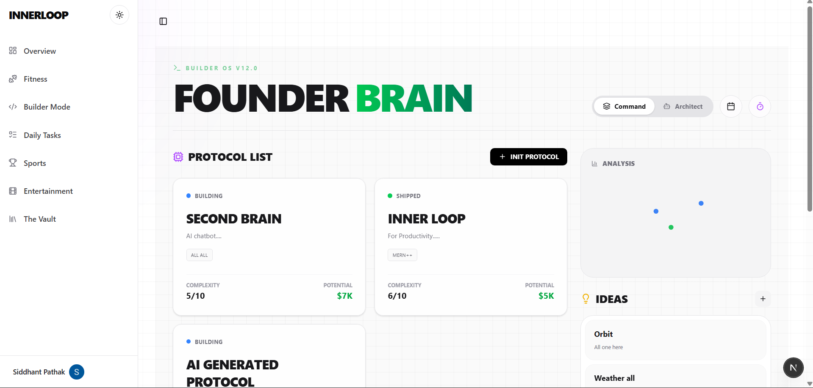
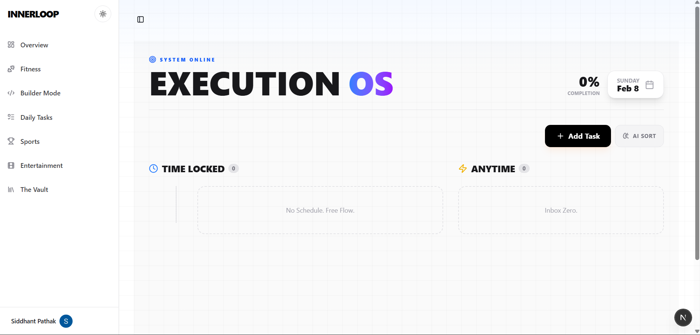
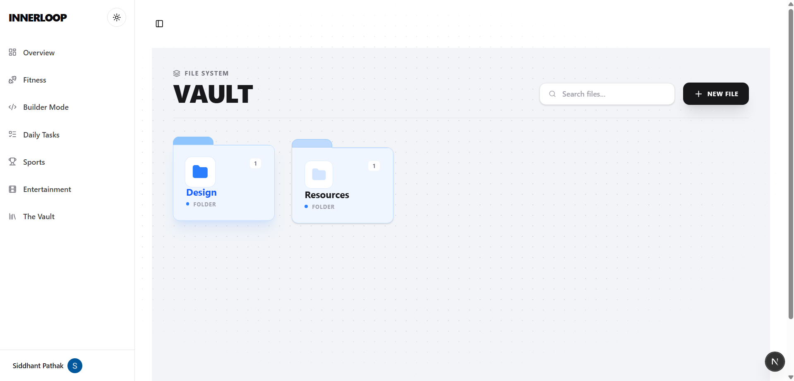
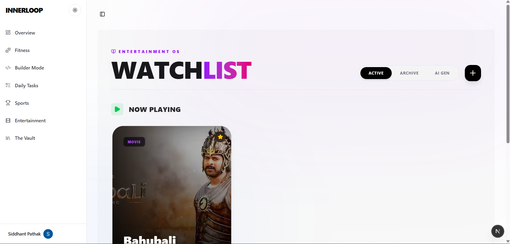

<div align="center">

# ♾️ InnerLoop (Nexus Prime)
<div align="center">
  
  &nbsp;&nbsp;
  
</div>

</br>

**Regain Your Sanity.**  
The all-in-one **Life Operating System** for High Performers.  
Fitness. Code. Sports. Life.

[](https://nextjs.org/)
[](https://www.typescriptlang.org/)
[](https://tailwindcss.com/)
[](https://orm.drizzle.team/)

[View Demo](https://innerloop-demo.vercel.app) · [Report Bug](https://github.com/your-username/innerloop/issues) · [Request Feature](https://github.com/your-username/innerloop/issues)

</div>

---

## 📖 Table of Contents

- [🛑 The Problem](#-the-problem)
- [✅ The Solution](#-the-solution)
- [✨ Key Features (The 6 Pillars)](#-key-features-the-6-pillars)
- [🛠️ Tech Stack](#️-tech-stack)
- [⚡ Installation & Setup](#-installation--setup)
- [📂 Project Structure](#-project-structure)
- [🧠 How It Works (Deep Dive)](#-how-it-works-deep-dive)
- [📸 Screenshots](#-screenshots)
- [🚀 Future Roadmap](#-future-roadmap)
- [🤝 Contributing](#-contributing)
- [✍️ Author](#️-author)

---

## 🛑 The Problem

<div align="center">

### Your digital life is scattered.

</div>

<table>
<tr>
<td width="50%">

📱 You track tasks in **Todoist**.  
🍎 You log calories in **MyFitnessPal**.  
🏏 You check scores on **Cricbuzz**.  
📝 You store ideas in **Notion**.  
💻 You view commits on **GitHub**.

</td>
<td width="50%">

### Result:

❌ **Switching context kills your flow.**  
💸 **You are paying $100/month for 5 different apps**  
⏰ **Just to manage your day.**

</td>
</tr>
</table>

---

## ✅ The Solution

<div align="center">

### **InnerLoop** (codenamed *Nexus Prime*)

Consolidates your entire existence into **ONE** unified, high-performance dashboard.

🎯 It's not just a productivity app  
🔥 It's a **Command Center** for your life.

Built with a **"Cyber-Professional"** aesthetic  
It adapts seamlessly to your workflow with a UI that feels alive.

</div>

---

## ✨ Key Features (The 6 Pillars)

InnerLoop is architected around **Six Core Modules**:

<br>

### 🧬 1. Bio-Core (Fitness Studio)

> *Stop guessing your health.*

<table>
<tr>
<td width="30%">

**💍 Holographic Rings**

</td>
<td width="70%">

Visualize Steps, Water, and Calories in real-time.

</td>
</tr>
<tr>
<td>

**🔥 Streak Heatmap**

</td>
<td>

GitHub-style graph for workout consistency.

</td>
</tr>
<tr>
<td>

**🍎 Macro Tracking**

</td>
<td>

Log meals and calculate Protein/Carbs/Fats instantly.

</td>
</tr>
</table>

<br>

### 🏟️ 2. The Arena (Sports Command)

> *Live intelligence for fanatics.*

<table>
<tr>
<td width="30%">

**⚡ Real-Time Scores**

</td>
<td width="70%">

Live updates for Cricket 🏏, Football ⚽, and F1 🏎️.

</td>
</tr>
<tr>
<td>

**🎨 Dynamic Theming**

</td>
<td>

The UI card changes color based on the sport (Green for Cricket, Red for F1).

</td>
</tr>
<tr>
<td>

**⚠️ Conflict Detection**

</td>
<td>

Warns you if a match clashes with your meeting.

</td>
</tr>
</table>

<br>

### 👨‍💻 3. Builder Mode (Dev Terminal)

> *For the creators.*

<table>
<tr>
<td width="30%">

**💻 Terminal UI**

</td>
<td width="70%">

A CLI-inspired interface to log your daily work.

</td>
</tr>
<tr>
<td>

**🔄 Git Integration**

</td>
<td>

Manually log commits to keep your streak alive.

</td>
</tr>
<tr>
<td>

**📈 Project Timeline**

</td>
<td>

Visualize your development velocity.

</td>
</tr>
</table>

<br>

### ⚡ 4. Command Deck (Task Management)

> *Chaos vs. Order.*

#### Split View Architecture:

<table>
<tr>
<th width="50%">

📅 LEFT (Schedule)

</th>
<th width="50%">

📝 RIGHT (Notepad)

</th>
</tr>
<tr>
<td>

Time-locked tasks for strict execution.

</td>
<td>

Flexible scratchpad for quick ideas.

</td>
</tr>
</table>

**✋ Drag & Drop:** Intuitive interaction for task organization.

<br>

### 🧠 5. The Vault (Second Brain)

> *Never lose an idea.*

<table>
<tr>
<td width="30%">

**💾 Smart Storage**

</td>
<td width="70%">

Save links, snippets, and secrets.

</td>
</tr>
<tr>
<td>

**🏷️ Auto-Tagging**

</td>
<td>

AI-powered categorization (Powered by Gemini).

</td>
</tr>
<tr>
<td>

**🔍 Search**

</td>
<td>

Instant access to your knowledge history.

</td>
</tr>
</table>

<br>

### 🎬 6. Cinema (Media Tracker)

> *Your personal box office.*

<table>
<tr>
<td width="30%">

**🎟️ Ticket UI**

</td>
<td width="70%">

A skeuomorphic ticket interface for active media.

</td>
</tr>
<tr>
<td>

**📝 Watchlist**

</td>
<td>

Track Movies, Series, and Anime.

</td>
</tr>
<tr>
<td>

**📊 Progress**

</td>
<td>

Remember exactly which episode you left off on.

</td>
</tr>
</table>

---

## 🛠️ Tech Stack

<div align="center">

### We used the bleeding edge of the React ecosystem to build this.

</div>

| Category | Technology | Description |
|:---:|:---:|:---|
| **⚛️ Framework** | **Next.js 14** | App Router, Server Actions |
| **📘 Language** | **TypeScript** | Strict typing for robustness |
| **🎨 Styling** | **Tailwind CSS** | Rapid UI development |
| **🗄️ Database** | **Neon DB (Postgres)** | Serverless SQL Database |
| **🔧 ORM** | **Drizzle ORM** | Type-safe SQL queries |
| **🔐 Auth** | **Clerk** | Secure middleware-protected auth |
| **✨ Animations** | **Framer Motion** | Complex micro-interactions |
| **🎭 UI Components** | **Aceternity UI** | 3D Cards, Parallax, Spotlights |

---

## ⚡ Installation & Setup

<div align="center">

### Follow these steps to run your own instance of InnerLoop.

</div>

<br>

### 1️⃣ Clone the Repository

```bash
git clone https://github.com/your-username/innerloop.git
cd innerloop
```

### 2️⃣ Install Dependencies

```bash
npm install
# or
yarn install
```

### 3️⃣ Environment Variables

Create a `.env.local` file in the root directory and add the following keys:

```bash
# 🗄️ Database (Neon Tech)
DATABASE_URL=postgresql://<user>:<password>@<host>/neondb?sslmode=require

# 🔐 Authentication (Clerk)
NEXT_PUBLIC_CLERK_PUBLISHABLE_KEY=pk_test_...
CLERK_SECRET_KEY=sk_test_...

# 🔄 Clerk Redirects
NEXT_PUBLIC_CLERK_SIGN_IN_URL=/sign-in
NEXT_PUBLIC_CLERK_SIGN_UP_URL=/sign-up
NEXT_PUBLIC_CLERK_AFTER_SIGN_IN_URL=/dashboard
NEXT_PUBLIC_CLERK_AFTER_SIGN_UP_URL=/dashboard

# 🤖 AI (Optional)
GOOGLE_API_KEY=AIza...
```

### 4️⃣ Database Setup

Push the schema to your Neon database.

```bash
npx drizzle-kit push
```

### 5️⃣ Run the App

```bash
npm run dev
```

Open **http://localhost:3000** to see the magic! 🪄

---

## 📂 Project Structure

<div align="center">

### A quick map of the codebase:

</div>

```
├── 📁 src
│   ├── 📁 app                 # Next.js App Router (Pages)
│   │   ├── 📁 (dashboard)     # Protected Routes (Fitness, Tasks, etc.)
│   │   ├── 📁 api             # API Routes (Webhooks)
│   │   └── 📄 page.tsx        # The "God Mode" Landing Page
│   ├── 📁 components
│   │   ├── 📁 global          # Shared (Sidebar, Navbar, ThemeToggle)
│   │   ├── 📁 landing         # 3D Landing Page Components
│   │   └── 📁 ui              # Atoms (Buttons, Cards, Inputs)
│   ├── 📁 lib
│   │   ├── 📁 actions         # Server Actions (Backend Logic)
│   │   ├── 📁 db              # Database Schema & Config
│   │   └── 📄 utils.ts        # Helper functions
│   └── 📄 middleware.ts       # Auth Protection Logic
├── 📁 drizzle                 # SQL Migrations
└── 📄 tailwind.config.ts      # Design System Config
```

---

## 🧠 How It Works (Deep Dive)

### 1. 🛡️ The "Middleware Guard"

- Before any page loads, `middleware.ts` runs.
- If you are **Logged Out** and try to access `/dashboard` → **Redirects to Sign In**.
- If you are **Logged In** and try to access Landing Page `/` → **Redirects to Dashboard**.
- **Result:** A seamless, secure flow.

### 2. 🚀 Server Actions & Drizzle

- We don't use traditional API routes (`/api/fitness`). Instead, we use **Server Actions**.
- When you click **"Save Workout"**, the function runs directly on the server.
- It connects to **Neon DB** via **Drizzle ORM**.
- **Result:** Zero-latency data fetching and fully type-safe backend code.

### 3. ✨ The "God Mode" UI

- The UI is built using a mix of **Shadcn** (for structure) and **Aceternity** (for wow factor).
- **Wobble Cards:** Use 3D transforms to react to mouse movement.
- **Hero Parallax:** Uses `useScroll` from Framer Motion to tilt the laptop as you scroll.
- **Theme Engine:** `next-themes` handles the switch between OLED Dark Mode and Crisp Light Mode instantly.

---


## 🎬 See It In Action

<div align="center">

### 🎥 Full Product Demo

https://github.com/user-attachments/assets/your-demo-video.mp4

<sub>*3-minute walkthrough of InnerLoop's 6 core modules*</sub>

**What You'll See:**
🧬 Fitness tracking | 🏟️ Sports scores | 👨‍💻 Code tracking | ⚡ Task management | 🧠 Smart vault | 🎬 Media tracker

</div>


## 📸 Screenshots

<table>
<tr>
<td align="center" width="50%">
  
  <br><b>🧬 Bio-Core (Fitness Studio)</b>
  <br><sub>Holographic rings + Streak heatmap</sub>
</td>
<td align="center" width="50%">
  
  <br><b>🏟️ The Arena (Sports Command)</b>
  <br><sub>Live scores with dynamic theming</sub>
</td>
</tr>

<tr>
<td align="center">
  
  <br><b>👨‍💻 Builder Mode (Dev Terminal)</b>
  <br><sub>Track commits and velocity</sub>
</td>
<td align="center">
  
  <br><b>⚡ Command Deck (Tasks)</b>
  <br><sub>Split-view: Schedule + Notepad</sub>
</td>
</tr>

<tr>
<td align="center">
  
  <br><b>🧠 The Vault (Second Brain)</b>
  <br><sub>AI-powered storage & search</sub>
</td>
<td align="center">
  
  <br><b>🎬 Cinema (Media Tracker)</b>
  <br><sub>Ticket-style watchlist UI</sub>
</td>
</tr>
</table>

</div>

---

## 🚀 Future Roadmap

| Status | Feature | Description |
|:---:|:---|:---|
| ⬜ | **📱 Mobile App** | Build a React Native companion app. |
| ⬜ | **🔄 GitHub Sync** | Auto-fetch commits via GitHub API. |
| ⬜ | **🤖 AI Analyst** | Chat with your data (e.g., "How many calories did I burn last week?"). |
| ⬜ | **💰 Finance Module** | Expense tracking integration. |

---

## 🤝 Contributing

<div align="center">

### Open source is at the heart of this project.

</div>

1. **Fork** the project.
2. Create your **Feature Branch** (`git checkout -b feature/AmazingFeature`).
3. **Commit** your changes (`git commit -m 'Add some AmazingFeature'`).
4. **Push** to the branch (`git push origin feature/AmazingFeature`).
5. Open a **Pull Request**.

---

## ✍️ Author

<div align="center">

Built with ❤️, ☕, and a lot of late nights by **Siddhant Pathak**.

[](https://github.com/your-username)
[](https://linkedin.com/in/your-username)
[](https://twitter.com/your-username)

   **"Master Your Chaos"**

</div>